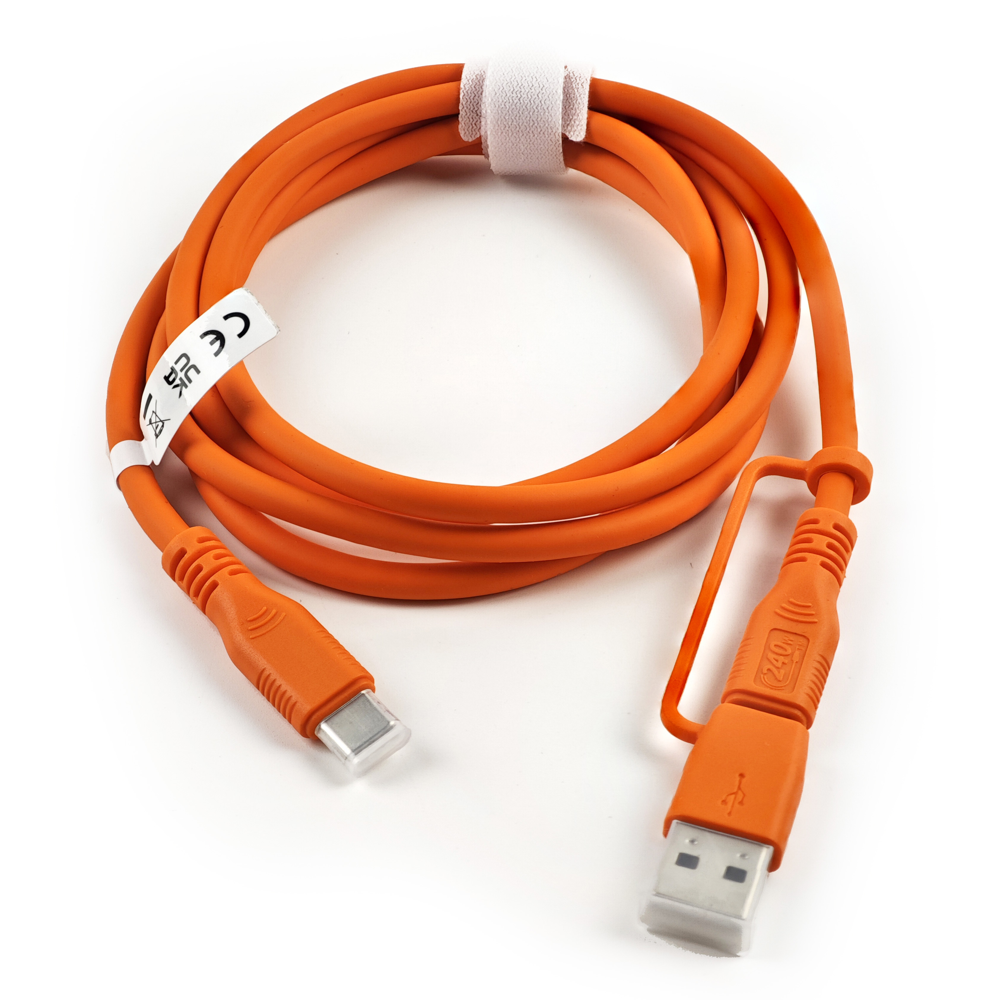
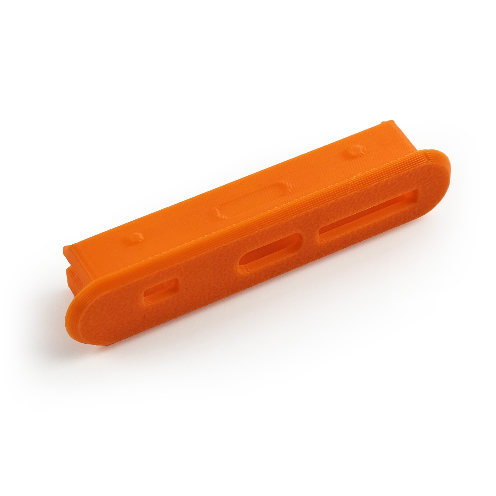

# Acessórios

Aqui, você encontrará diversos produtos que complementam e aprimoram a funcionalidade do Openterface Mini-KVM. Nosso objetivo é oferecer uma variedade de acessórios que tornem sua experiência com o Mini-KVM ainda mais versátil e conveniente.

## Cabo Conversor VGA para HDMI

{:style="height:360px"}

Este produto converte vídeo VGA e integra áudio em HDMI, permitindo a fácil conexão de dispositivos VGA a monitores HDMI.

- **Modelo**: CABLE100-VGA2HDMI
- **Comprimento**: 1M
- **Resolução de Vídeo de Saída**: 1920x1080P Full HD
- **Entrada de Áudio**: Conector de áudio de 3,5mm
- **Saída de Áudio**: via HDMI
- **Fonte de Alimentação**: Alimentado via USB

### Caso de Uso
Para um caso de uso detalhado deste cabo, visite [Gerenciamento de Servidor Simplificado](/use-cases/#streamlined-server-management).

### Vídeo Demonstrativo
Assista ao vídeo demonstrativo do influenciador de tecnologia **Cameron Gray** sobre como usar este cabo com o Mini-KVM: [Este Console USB KVM é Incrível!](https://youtu.be/xAEQpWyfY-c?si=auB5NtqHVw2C7iIK&t=1693)

<button class="md-button" onclick="window.location.href='https://www.crowdsupply.com/techxartisan/openterface-mini-kvm#products'">Fazer Pedido</button>

---

## Cabo Tipo-C para USB-A com Adaptador

{:style="height:360px"}

Este versátil cabo Tipo-C Macho para USB-A Macho, acompanhado de um adaptador USB-A Fêmea para USB-C Macho, oferece conectividade flexível para dispositivos alvo. Ele permite a transferência de dados e a transmissão de sinais de controle de teclado e mouse, independentemente de o dispositivo alvo usar uma porta USB-A ou Tipo-C.

- **Comprimento**: 0,3m
- **Cor**: Preto
- **Adaptador**: USB-A Fêmea para USB-C Macho
- **Uso**: Facilita o controle e a transferência de dados para o dispositivo alvo.

---

## Cabo Tipo-C para Tipo-C com Adaptador

{:style="height:360px"}

Este elegante cabo Tipo-C Macho para Macho, com toque suave e na cor laranja vibrante, é projetado para conexões com computadores host. Ele vem com um adaptador USB-C Fêmea para USB-A Macho para maior compatibilidade, garantindo que você possa se conectar a computadores host usando portas Tipo-C ou USB-A. Além disso, este cabo suporta **carregamento rápido de 240W** (Tensão DC50V, Corrente 5A, Potência 240W), sendo perfeito não apenas para nossos Mini-KVMs, mas também para carregar seu celular ou laptop.

- **Comprimento**: 1,5m
- **Cor**: Laranja
- **Adaptador**: USB-C Fêmea para USB-A Macho
- **Uso**: Para transferência de dados em alta velocidade entre o computador host e o Mini-KVM, e para carregamento rápido de celulares ou laptops.

---

## Cabo HDMI Macho para Macho

{:style="height:360px"}

Este cabo HDMI compacto é perfeito para conectar seu dispositivo alvo e capturar a saída de vídeo, garantindo uma integração perfeita com seu Openterface Mini-KVM.

- **Comprimento**: 0,3m
- **Cor**: Preto
- **Uso**: Ideal para transmissão de vídeo em alta definição do dispositivo alvo para o Mini-KVM.

---

## Bolsa de Ferramentas Openterface

{:style="height:360px"}

Mantenha seu Openterface Mini-KVM e seus acessórios organizados e portáteis com esta bolsa de ferramentas compacta. Com um zíper laranja estiloso e bolsos de malha elástica, esta bolsa garante excelente gerenciamento de cabos e facilidade de transporte, perfeita para profissionais de TI em movimento.

- **Dimensões**: 180 x 115 x 50mm
- **Cor**: Preto com zíper laranja
- **Uso**: Ideal para armazenar e organizar seu Mini-KVM e seus cabos.

---

## Tampa de Pino de Extensão

{:style="height:360px"}

Esta Tampa de Pino de Extensão impressa em 3D substitui a tampa original do Openterface Mini-KVM, permitindo que usuários avançados exponham e acessem pinos de extensão para desenvolvimento personalizado. Você pode baixar os arquivos do modelo 3D do nosso repositório GitHub e imprimir a tampa você mesmo.

- **Uso**: Fornece acesso aos pinos de extensão para desenvolvimento avançado de hardware.
- **Download**: [Arquivos do Modelo 3D](https://github.com/TechxArtisanStudio/Openterface_Mini-KVM_Hardware/tree/main/models)

---

## Mais em Breve

Fique atento para mais acessórios que serão adicionados a esta seção, projetados para aprimorar sua experiência com o Openterface Mini-KVM.