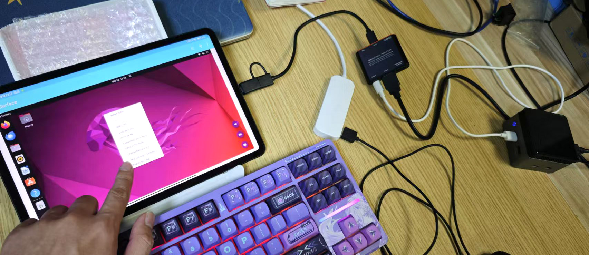

# Superando Obstáculos: Atualização de Progresso e Novo Cronograma

Olá pessoal,

Espero que todos estejam bem. Faz um tempo desde nossa última atualização. Gostaria de dizer que tudo está indo perfeitamente para a Openterface, mas encontramos alguns obstáculos que atrasarão nosso cronograma de entrega. Embora isso não fosse o esperado, estamos enfrentando esses desafios de frente e fazendo progressos constantes com muitas boas notícias para compartilhar. Este post é uma leitura de aproximadamente **7 minutos**, então vamos aos detalhes para que você saiba exatamente onde estamos e o que vem a seguir.

## Regulamentação, Produção e Qualidade

Antes de iniciarmos a produção, tivemos que passar por testes de qualidade necessários de acordo com as regulamentações, especialmente a certificação CE. Como nossa versão do kit inclui não apenas o Mini-KVM, mas também vários acessórios, cada parte precisou passar pelos testes CE. Esses testes demoraram mais do que esperávamos (descobrimos que cabos podem ser bem exigentes), mas a boa notícia é que **passamos na certificação CE para nosso Mini-KVM e todos os seus componentes!** Abaixo está uma visão geral das certificações de todas as nossas partes: Mini-KVM, cabo HDMI, cabo Type-C laranja, cabo Type-C preto curto e cabo VGA2HDMI. Com a certificação em mãos, nosso cronograma de produção agora está certo, e nossos fabricantes estão **produzindo todas as partes** enquanto falo.

*Os requisitos do UKCA e CE são os mesmos para nossos produtos eletrônicos, com o CE também cobrindo a conformidade RoHS.*

Duas semanas atrás, visitamos um de nossos fabricantes para treinar seus gerentes de linha sobre controle de qualidade para os cabos laranja antes de enviá-los para nós. Agora, TODOS os cabos laranja foram produzidos e estão em um canto do nosso estúdio.

*Kevin e Shawn estavam explicando os métodos de teste para garantir que o cabo laranja funcione corretamente com nosso Openterface Mini-KVM.*

Faremos a mesma tarefa esta semana para treinar a equipe de QA na linha de produção para outras partes também. Aqui estão amostras de cabos adicionais.

*Orgulhosamente marcados com nosso logotipo TechxArtisan, estas são amostras do cabo HDMI, do cabo Type-C curto e do cabo VGA-para-HDMI.*

Estamos esperando que as outras partes e Mini-KVMs cheguem em breve de nossos fabricantes, momento em que verificaremos a qualidade de cada componente e os embalaremos adequadamente em nosso estúdio antes do envio. Em outras palavras, **nossa equipe garantirá pessoalmente a qualidade** antes de chegar às suas mãos.

## Envio, Possíveis Atrasos e Novo ETA

**A incerteza atual está no processo de envio**. Após investigar várias empresas de transporte, descobrimos que o envio levará mais tempo, pois provavelmente transferiremos os pacotes por um armazém antes de chegar ao armazém da Crowd Supply. Ainda estamos debatendo se escolhemos transporte marítimo ou aéreo—por favor, tenham paciência conosco por mais alguns dias enquanto resolvemos os arranjos.

A liberação alfandegária é outro obstáculo potencial que pode causar atrasos inesperados. Uma vez que nossos produtos cheguem ao armazém da Crowd Supply nos EUA, levará de uma a duas semanas para serem enviados globalmente com base em cada pedido. Para apoiadores fora dos EUA, os pacotes individuais ainda precisarão passar pelo envio global e pela liberação alfandegária no país de destino.

Levando em conta a situação atual e adicionando algum tempo de buffer, permaneço cautelosamente otimista de que completaremos a entrega antes do final deste ano, com **um novo ETA para meados de janeiro**. Sinto muito pelo inconveniente e agradeço seu apoio e paciência durante essa mudança.

## Hardware V1.9 Finalizado

Como você deve saber do nosso [post no Reddit](https://www.reddit.com/r/Openterface_miniKVM/comments/1e25pco/openterface_minikvm_v19_with_pins_for_more/), decidimos **atualizar nosso hardware para V1.9**, incluindo um conjunto de pinos de expansão hackeáveis. Isso não fazia parte do plano original para a campanha de financiamento coletivo, mas acreditamos que melhora significativamente o **potencial de uso mais amplo** do hardware.

*Os pinos VCC, GND, Target D+, Target D-, Host D+ e Host D-—onde ‘D’ significa dados USB.*

Uma motivação chave foi permitir que **a chave USB fosse alternada no nível do software**. Por que isso é importante? Em nosso roadmap, **pretendemos suportar uma solução KVM-over-IP**, como VNC, no futuro. A ideia é combinar o controle KVM local com o protocolo VNC, permitindo que os usuários controlem remotamente o computador alvo via computador host. Em um cenário remoto como esse, a capacidade dos usuários de alternar a porta USB é essencial, especialmente quando transferências de arquivos entre o host e o alvo são necessárias.

**Os pinos de expansão também abrem possibilidades para mais**, como integração com iPadOS, controle ATX, ponte de rede e bypass de áudio. Embora eu não vá entrar em todos os detalhes aqui, encorajo você a se juntar à nossa comunidade Openterface para discutir mais conosco.

Esta atualização de hardware pode potencialmente estender nossa solução Openterface para operar via IP e incluir mais recursos avançados, mantendo sua força principal como uma ferramenta KVM-over-USB plug-and-play—perfeita para profissionais de TI navegando em ambientes de TI incertos, como data centers desconhecidos.

Estou feliz em informar que o V1.9 passou em nossos testes básicos internos e será finalizado como a versão oficial para todos os nossos apoiadores. No entanto, essa atualização de hardware exigirá mais testes, e qualquer desenvolvimento baseado nesses pinos de expansão será experimental e provavelmente terá bugs. É aqui que você pode contribuir. Contamos com a comunidade open-source para nos ajudar a melhorar o Openterface juntos.

## Mais Atualizações de Software

No front do software, estamos fazendo avanços empolgantes. Estamos mergulhando no **aplicativo Openterface para Android** agora! Confira este [tweet](https://x.com/TechxArtisan/status/1825460088922071398) para um demo inicial mostrando controle KVM suave, movimento do mouse e cliques em ação. Mais recursos estão a caminho e, como sempre, assim que polirmos um pouco mais o código, **este aplicativo também será open-source** em nosso repositório GitHub [Openterface_Android](https://github.com/TechxArtisanStudio/Openterface_Android).

*Usando apenas nossos dedos para controlar um computador Linux a partir de um tablet Android. Legal!*

Nossa versão QT acabou de receber uma atualização útil—você pode agora [transferir texto do host para o alvo](https://x.com/TechxArtisan/status/1825919721960780131)! Então agora esse recurso é suportado nos aplicativos host para macOS, Windows e Linux.

Além disso, estamos planejando adicionar um recurso divertido — [um movimento automático do mouse para evitar que seu computador alvo durma](https://x.com/TechxArtisan/status/1825471186668847241). Devemos ir com a bola de ping-pong quicando pela tela ou o clássico efeito de protetor de tela do DVD? Vote e comente no [tweet](https://x.com/TechxArtisan/status/1825470086800691459) 😃

## Design de Embalagem, Rotulagem e Manual

Estamos [experimentando com vários mock-ups e designs de embalagem](https://www.reddit.com/r/Openterface_miniKVM/comments/1elm4vq/almost_ready_to_finalize_our_package_design/) para encontrar o equilíbrio perfeito entre vários fatores chave:

- Selecionar materiais resistentes o suficiente para proteger o produto e suas partes durante o envio,
- Criar rótulos informativos que ajudem os usuários a entender o produto de relance,
- Garantir conformidade com as regulamentações,
- Tornar a embalagem visualmente atraente,
- E ser ecologicamente correto, minimizando o uso de plástico sempre que possível.

Além disso, fizemos várias melhorias na antiga bolsa do kit, incluindo:

- Maior espaço de armazenamento,
- Um zíper laranja estiloso,
- Materiais externos e internos atualizados,
- E um bolso de malha super elástico.

Escolhemos este material porque atinge o equilíbrio ideal entre ser econômico, agradável ao toque e durável o suficiente para proteger os itens dentro. **Estamos confiantes de que você vai adorar**.

Também estamos atualizando os rótulos no estojo de alumínio para torná-los o mais informativos e visualmente atraentes possível. Esperamos que essas melhorias melhorem sua experiência de usuário e tornem mais fácil começar a usar o Openterface.

Estamos finalizando o manual do Openterface, que estará disponível em inglês, alemão, francês, japonês e chinês. Pedimos desculpas se não incluímos seu idioma—nossa caixa não é do tamanho de uma TARDIS (a cabine policial do Doctor Who)! Mas faremos o nosso melhor para adicionar mais traduções em nosso site.

## Revisão de Idiomas pela Comunidade

Tenho usado o ChatGPT para ajudar com as traduções, mas às vezes ele pode errar na formulação e na escolha das palavras. Se não for muito incômodo, eu agradeceria muito qualquer ajuda na revisão do conteúdo em outros idiomas, especialmente para os materiais impressos que estamos prestes a finalizar. Atualizei todo o conteúdo de texto para a embalagem em nossa pasta GitHub [product-printed-materials](https://github.com/TechxArtisanStudio/Openterface/tree/main/product-printed-materials), onde você pode revisar e enviar quaisquer melhorias. Você também pode me enviar uma mensagem diretamente. Obrigado!

## Considerações Finais e Progresso Contínuo

Pedimos desculpas novamente pelos atrasos e pela mudança no ETA do nosso produto. Obrigado por sua paciência e por estar conosco—estamos trabalhando duro para entregar isso a você o mais rápido possível! Atualizarei você imediatamente assim que nosso envio for arranjado. Mais atualizações estão a caminho, então por favor, junte-se à nossa comunidade Openterface e fique ligado!

Saudações,

Billy Wang  
Gerente de Produto  
Equipe Openterface | TechxArtisan