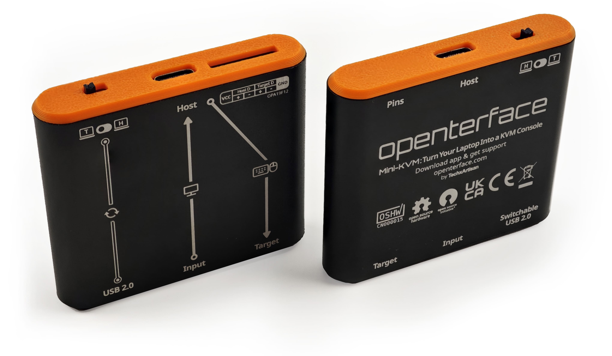

# Hardware Aberto

{:style="max-height:400px"}

## Explore os Detalhes do Hardware

- [Openterface_Mini-KVM_Hardware](https://github.com/TechxArtisanStudio/Openterface_Mini-KVM_Hardware): Explore nosso design de hardware abrangente, esquemas e componentes.
- [Pinos de Extensão](pin.md): Aprenda a acessar e usar os pinos de extensão para desenvolvimento e experimentação avançados.

## Conformidade com OSHWA

{:style="height:120px"}
{:style="height:100px"}

Nosso Openterface Mini-KVM é orgulhosamente certificado pela **Open Source Hardware Association** (OSHWA). Esta certificação OSHWA ([**UID CN000015**](https://certification.oshwa.org/cn000015.html)) confirma nosso compromisso com os princípios do hardware aberto, garantindo que todos os arquivos de design, documentação e código-fonte estejam disponíveis gratuitamente para estudo, modificação, distribuição e fabricação.

## Participe da Diversão do Desenvolvimento

Estamos empolgados para explorar o potencial do hardware e desses pinos de extensão, e convidamos você a se juntar a nós nesta aventura! À medida que continuamos a desenvolver e experimentar, atualizaremos esta seção com mais informações sobre o que esses pinos podem fazer e como podem ser usados de forma criativa.

### Em Breve
- Explicações detalhadas sobre a funcionalidade dos pinos
- Exemplos de projetos DIY mostrando usos inovadores dos pinos de extensão
- Ideias e implementações contribuídas pela comunidade

### Envolva-se
1. **Compartilhe Suas Ideias**: Tem um conceito legal para usar esses pinos? Adoraríamos ouvir!
2. **Contribua com Projetos DIY**: Se você criou algo interessante, considere compartilhar com a comunidade.
3. **Participe da Discussão**: Conecte-se com outros desenvolvedores e entusiastas para trocar ideias e colaborar.

Fique atualizado e participe das discussões sobre o desenvolvimento dos pinos de extensão em nossa [comunidade no Discord](/discord) ou [Reddit](/reddit).

Sua criatividade e expertise podem ajudar a expandir os limites do que é possível com o Openterface Mini-KVM. Vamos inovar juntos!
